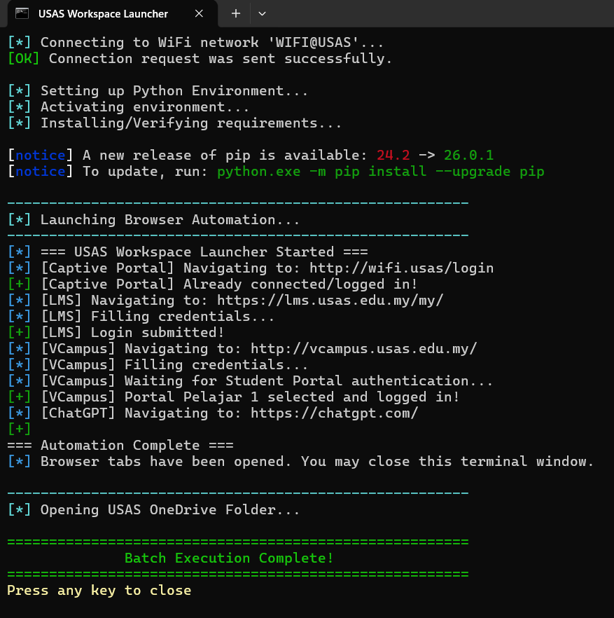

# USAS Workspace Launcher


<p align="center">
  
</p>

A high-performance, automated workspace initialization suite built with Python and Selenium. Capable of instantly connecting to the campus network and securely authenticating into essential academic platforms without user interaction.

> [!NOTE]
> **Personal Use**: This tool authenticates using your real student credentials. Ensure your usage complies with university IT policies. Only use this to access academic portals you have legitimate access to.

## Features

- 🚀 **High Performance**: `eager` page loading strategies and direct JavaScript execution for instantaneous portal bypasses.
- 🎨 **Modern UI**: Beautiful, color-coded ANSI terminal interface mimicking a CLI environment.
- 🖥️ **Persistent Profiles**: Integrates seamlessly with your primary Google Chrome profile, ensuring extensions remain intact.
- 🔄 **Smart Handling**: Automatically handles locked Chrome profiles with interactive retry loops.
- 🛡️ **Secure Credentials**: Passwords are encrypted directly into the native **Windows Credential Manager** via `keyring`. Only generic IDs are stored in the local `.env` file. Terminal inputs are masked with asterisks using `pwinput`.
- 🤖 **Auto-Discovery**: Automatically parses generic login fields (username, userid, email, password, etc) for robust compatibility.
- 💻 **CLI & Interactive**: Run it fully automated via the one-click Batch script.

## Installation

1. **Clone the repository**
   ```bash
   git clone https://github.com/zis3c/USAS-Launcher
   cd USAS-Launcher
   ```

2. **Install dependencies**
   ```bash
   pip install -r requirements.txt
   ```

## Project Structure

```
USAS-Launcher/
├── usas_auth_controller.py     # Main Python engine - browser automation, credential management
├── USAS_Workspace_Launcher.bat # System orchestrator - handles WiFi, Python venv, and execution
├── requirements.txt            # Python dependencies (Selenium, dotenv, colorama, pwinput, keyring)
├── .env.example                # Template for ID credentials
├── preview.png                 # CLI preview screenshot
├── TOOL_DOCUMENTATION.md       # Capabilities and awareness guide
└── CONTRIBUTING.md             # Contribution guidelines
```

## Usage

### Interactive Mode
Simply execute `USAS_Workspace_Launcher.bat`. On the first run, the script will securely prompt you for your credentials using masked terminal inputs. Passwords are saved directly to your encrypted **Windows Credential Manager**, while IDs are saved to a hidden local `.env` file.

### Daily Automation
For every subsequent run, simply execute `USAS_Workspace_Launcher.bat` and watch it automatically:
1. Connect to the university WiFi.
2. Setup the Python environment.
3. Launch a background Chrome Service.
4. Auto-login to the Captive Portal.
5. Auto-login to LMS.
6. Auto-login to VCampus (Portal Pelajar 1).
7. Open a new tab for ChatGPT.
8. Automatically open your local USAS OneDrive folder.

## How It Works

1. **Network Layer**: Uses native Windows `netsh` commands to force connections to specific SSIDs.
2. **Setup Layer**: Uses Windows Batch scripting to orchestrate Python `venv` creation, dependency injection, and cleanup.
3. **Execution Layer**: Uses Selenium WebDriver with detached creation flags so it runs completely independent of the command console.
4. **Automation**: Analyzes the DOM for common semantic login markers and leverages `implicitly_wait` for robust loading.

## Contributing

Contributions are welcome! Please see [CONTRIBUTING.md](CONTRIBUTING.md) for guidelines on reporting bugs, suggesting enhancements, and submitting pull requests.

## License

This project is licensed under the MIT License - see the [LICENSE](LICENSE) file for details.
